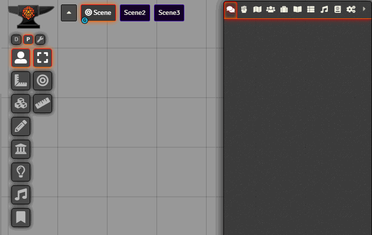

# FoundryVTT - Control concealer
 
 
  

**[Compatibility]**: *FoundryVTT* 0.9.0+  
**[Systems]**: *any*  
**[Languages]**: *English*  

Adds two customizable tabs to the controls bar(on the left) and let's you hide tools(or complete layer controls) in each of those.
Should you add or remove modules after you have made a selection this will try to adapt your previous selectiong to the added or deleted tools.

This is for everyone that has a lot of modules that add their tools to the layer controls on the left side and also for everyone that
might have a lot of tools they use while preparing games but a lot less or different while actually playing.

## Installation

1. control-concealer using manifest URL: https://raw.githubusercontent.com/KayelGee/control-concealer/master/module.json
2. While loaded in World, enable **_Control concealer"_** module.

## Usage

Above the layer controls are 3 buttons. One is the development tab, another the production tab. You can switch between these two
by clicking on the button. To edit which tools(or sidebar tabs) are hidden in the current tab click the edit button. Then select all tools(or sidebar tabs) you want
hidden by right-clicking it. Then to save your selection press the edit button again.

To copy control settings from one player to other players see the included macro "(CC)Copy Controls to Users", edit "copyUser" and "targetUsers" to match the names of your users.

## Contact

If you wish to contact me for any reason, reach me out on Discord using my tag: `KayelGee#5241`

## Credits

Combat Carousel Fix provided by dhorkin